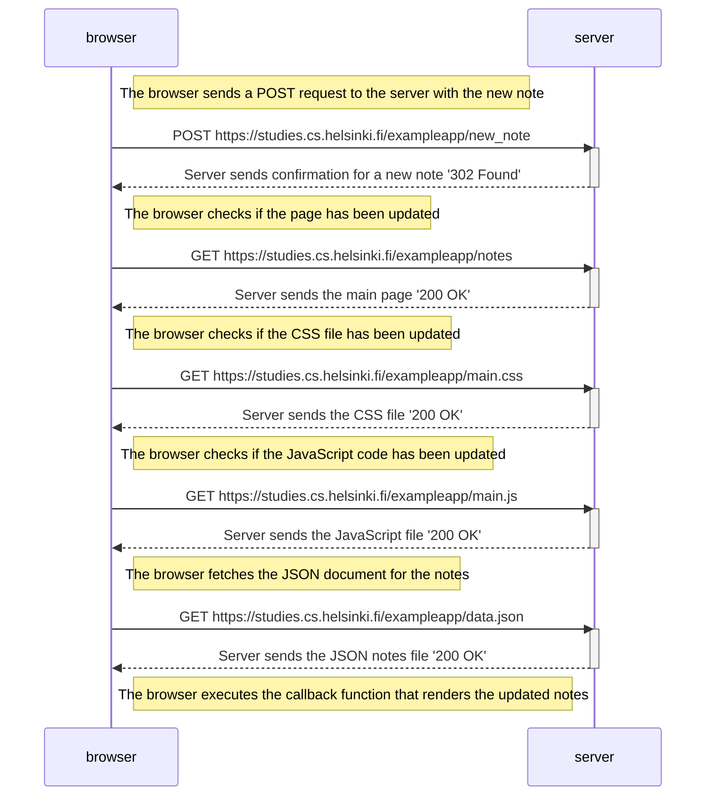

```mermaid
sequenceDiagram
participant browser
participant server

    Note right of browser: The browser sends a POST request to the server with the new note

    browser->>server: POST https://studies.cs.helsinki.fi/exampleapp/new_note
    activate server
    server-->>browser: Server sends confirmation for a new note '302 Found'
    deactivate server

    Note right of browser: The browser checks if the page has been updated

    browser->>server: GET https://studies.cs.helsinki.fi/exampleapp/notes
    activate server
    server-->>browser: Server sends the main page '200 OK'
    deactivate server
    
    Note right of browser: The browser checks if the CSS file has been updated

    browser->>server: GET https://studies.cs.helsinki.fi/exampleapp/main.css
    activate server
    server-->>browser: Server sends the CSS file '200 OK'
    deactivate server

    Note right of browser: The browser checks if the JavaScript code has been updated

    browser->>server: GET https://studies.cs.helsinki.fi/exampleapp/main.js
    activate server
    server-->>browser: Server sends the JavaScript file '200 OK'
    deactivate server
    
    Note right of browser: The browser fetches the JSON document for the notes

    browser->>server: GET https://studies.cs.helsinki.fi/exampleapp/data.json
    activate server
    server-->>browser: Server sends the JSON notes file '200 OK'
    deactivate server

    Note right of browser: The browser executes the callback function that renders the updated notes
```
