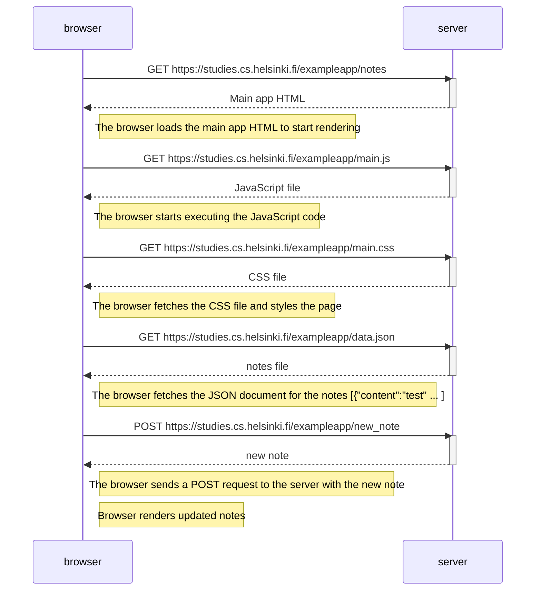

```mermaid
sequenceDiagram
participant browser
participant server

    browser->>server: GET https://studies.cs.helsinki.fi/exampleapp/notes
    activate server
    server-->>browser: Main app HTML
    deactivate server

    Note right of browser: The browser loads the main app HTML to start rendering

    browser->>server: GET https://studies.cs.helsinki.fi/exampleapp/main.js
    activate server
    server-->>browser: JavaScript file
    deactivate server

    Note right of browser: The browser starts executing the JavaScript code

    browser->>server: GET https://studies.cs.helsinki.fi/exampleapp/main.css
    activate server
    server-->>browser: CSS file
    deactivate server

    Note right of browser: The browser fetches the CSS file and styles the page

    browser->>server: GET https://studies.cs.helsinki.fi/exampleapp/data.json
    activate server
    server-->>browser: notes file
    deactivate server

    Note right of browser: The browser fetches the JSON document for the notes [{"content":"test" ... ]

    browser->>server: POST https://studies.cs.helsinki.fi/exampleapp/new_note
    activate server
    server-->>browser: new note
    deactivate server

    Note right of browser: The browser sends a POST request to the server with the new note

    Note right of browser: Browser renders updated notes
```
