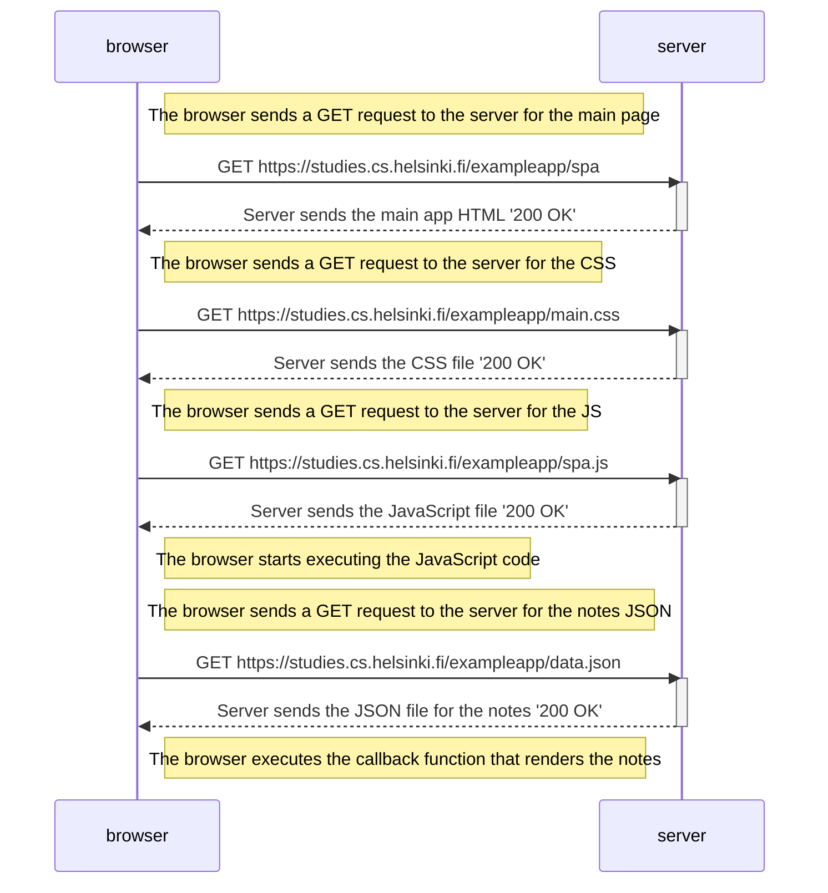

```mermaid
sequenceDiagram
participant browser
participant server

    Note right of browser: The browser sends a GET request to the server for the main page

    browser->>server: GET https://studies.cs.helsinki.fi/exampleapp/spa
    activate server
    server-->>browser: Server sends the main app HTML '200 OK'
    deactivate server

    Note right of browser: The browser sends a GET request to the server for the CSS

    browser->>server: GET https://studies.cs.helsinki.fi/exampleapp/main.css
    activate server
    server-->>browser: Server sends the CSS file '200 OK'
    deactivate server

    Note right of browser: The browser sends a GET request to the server for the JS

    browser->>server: GET https://studies.cs.helsinki.fi/exampleapp/spa.js
    activate server
    server-->>browser: Server sends the JavaScript file '200 OK'
    deactivate server

    Note right of browser: The browser starts executing the JavaScript code

    Note right of browser: The browser sends a GET request to the server for the notes JSON

    browser->>server: GET https://studies.cs.helsinki.fi/exampleapp/data.json
    activate server
    server-->>browser: Server sends the JSON file for the notes '200 OK'
    deactivate server

    Note right of browser: The browser executes the callback function that renders the notes
```
