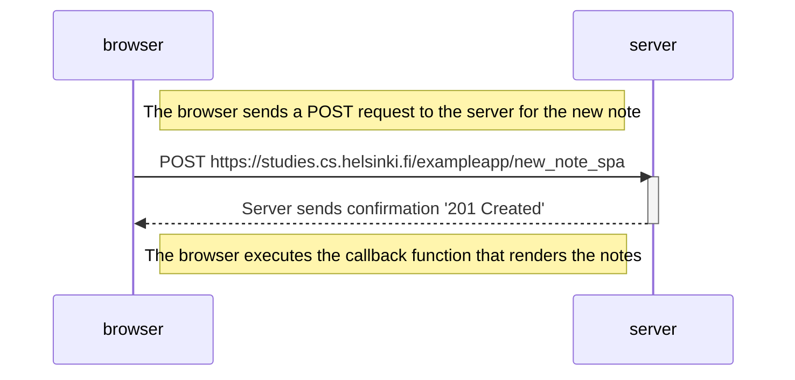

```mermaid
sequenceDiagram
participant browser
participant server

    Note right of browser: The browser sends a POST request to the server for the new note

    browser->>server: POST https://studies.cs.helsinki.fi/exampleapp/new_note_spa
    activate server
    server-->>browser: Server sends confirmation '201 Created'
    deactivate server

    Note right of browser: The browser executes the callback function that renders the notes
```
